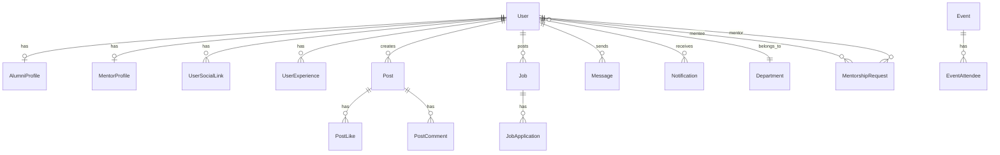

# 🗄️ Database Architecture & Schema Map

The Alumni Management Portal uses **PostgreSQL** with **19 relational tables** managed via Django's ORM.

> **Source of Truth:** [`backend/api/models.py`](../backend/api/models.py)  
> To generate raw SQL: `python manage.py sqlmigrate api 0001`

---

## Architecture Overview



---

## 1. Authentication & Profiling Domain (7 Tables)

### `users` — Core user table
Extended Django AbstractUser. Uses **email** as the primary identifier (no username).

| Column | Type | Description |
|--------|------|-------------|
| `id` | BigAutoField (PK) | Primary key |
| `email` | EmailField (unique) | Login identifier |
| `first_name` | CharField | First name |
| `last_name` | CharField | Last name |
| `password` | CharField | Hashed password |
| `role` | CharField | `admin`, `alumni`, `coordinator`, `mentor` |
| `department_id` | FK → Department | Academic department |
| `batch_year` | IntegerField | Graduation year |
| `phone` | CharField | Contact number |
| `avatar_url` | URLField | Profile picture URL |
| `status` | CharField | `pending`, `approved`, `rejected` |
| `is_active` | BooleanField | Account active flag |
| `date_joined` | DateTimeField | Registration timestamp |

### `departments`
| Column | Type | Description |
|--------|------|-------------|
| `id` | BigAutoField (PK) | Primary key |
| `name` | CharField (unique) | e.g., "Computer Engineering" |
| `code` | CharField | Short code, e.g., "COMP" |

### `alumni_profiles` — 1:1 extension for alumni
| Column | Type | Description |
|--------|------|-------------|
| `user_id` | FK → User (OneToOne) | Owner |
| `current_company` | CharField | Current employer |
| `current_role` | CharField | Job title |
| `bio` | TextField | About section |
| `resume_url` | URLField | Resume file link |
| `skills` | ArrayField(CharField) | List of skills |
| `languages` | ArrayField(CharField) | Spoken languages |

### `mentor_profiles` — 1:1 extension for mentors
| Column | Type | Description |
|--------|------|-------------|
| `user_id` | FK → User (OneToOne) | Owner |
| `specialization` | CharField | Area of expertise |
| `max_mentees` | IntegerField | Capacity limit |
| `active_mentees` | IntegerField | Current mentee count |
| `bio` | TextField | Mentor bio |

### `user_social_links` — 1:Many social profiles
| Column | Type | Description |
|--------|------|-------------|
| `user_id` | FK → User | Owner |
| `platform` | CharField | e.g., "LinkedIn", "GitHub" |
| `url` | URLField | Profile URL |

### `user_experiences` — 1:Many career timeline
| Column | Type | Description |
|--------|------|-------------|
| `user_id` | FK → User | Owner |
| `company` | CharField | Company name |
| `role` | CharField | Job title |
| `start_date` | DateField | Start date |
| `end_date` | DateField | End date (null = current) |
| `description` | TextField | Role description |

---

## 2. Interactive Networking Domain (6 Tables)

### `posts` — Social feed
| Column | Type | Description |
|--------|------|-------------|
| `user_id` | FK → User | Author |
| `content` | TextField | Post body |
| `image_url` | URLField | Optional image |
| `created_at` | DateTimeField | Timestamp |

### `post_likes` — Like tracking
| Column | Type | Description |
|--------|------|-------------|
| `post_id` | FK → Post | Liked post |
| `user_id` | FK → User | User who liked |
| **Constraint** | unique_together | (post, user) — prevents double-likes |

### `post_comments` — Comment thread
| Column | Type | Description |
|--------|------|-------------|
| `post_id` | FK → Post | Parent post |
| `user_id` | FK → User | Commenter |
| `content` | TextField | Comment text |
| `created_at` | DateTimeField | Timestamp |

### `messages` — Direct messaging
| Column | Type | Description |
|--------|------|-------------|
| `sender_id` | FK → User | Message sender |
| `receiver_id` | FK → User | Message receiver |
| `content` | TextField | Message body |
| `read_status` | BooleanField | Read receipt |
| `sent_at` | DateTimeField | Timestamp |

### `notifications` — System notifications
| Column | Type | Description |
|--------|------|-------------|
| `user_id` | FK → User | Recipient |
| `title` | CharField | Notification title |
| `message` | TextField | Notification body |
| `notification_type` | CharField | Category |
| `is_read` | BooleanField | Read state |
| `created_at` | DateTimeField | Timestamp |

### `mentorship_requests` — Mentorship pipeline
| Column | Type | Description |
|--------|------|-------------|
| `mentee_id` | FK → User | Requesting student |
| `mentor_id` | FK → User | Target mentor |
| `message` | TextField | Request message |
| `status` | CharField | `pending`, `approved`, `rejected` |
| `created_at` | DateTimeField | Timestamp |
| **Constraint** | unique_together | (mentee, mentor) — prevents duplicate requests |

---

## 3. Structural & Content Domain (6 Tables)

### `jobs` — Job board
| Column | Type | Description |
|--------|------|-------------|
| `title` | CharField | Job title |
| `company` | CharField | Company name |
| `location` | CharField | Job location |
| `job_type` | CharField | `full_time`, `part_time`, `internship`, `contract` |
| `experience_required` | CharField | Experience range |
| `description` | TextField | Full description |
| `posted_by_id` | FK → User | Creator |
| `status` | CharField | `pending_coordinator`, `pending_admin`, `approved`, `rejected` |
| `created_at` | DateTimeField | Timestamp |

### `job_applications` — Application tracking
| Column | Type | Description |
|--------|------|-------------|
| `job_id` | FK → Job | Applied job |
| `applicant_id` | FK → User | Applicant |
| `cover_letter` | TextField | Cover letter text |
| `status` | CharField | `pending`, `reviewed`, `accepted`, `rejected` |
| `applied_at` | DateTimeField | Timestamp |
| **Constraint** | unique_together | (job, applicant) — prevents double applications |

### `events` — Event management
| Column | Type | Description |
|--------|------|-------------|
| `title` | CharField | Event name |
| `description` | TextField | Event details |
| `event_date` | DateTimeField | Event date/time |
| `location` | CharField | Event venue |
| `created_by_id` | FK → User | Organizer |
| `created_at` | DateTimeField | Timestamp |

### `event_attendees` — RSVP tracking
| Column | Type | Description |
|--------|------|-------------|
| `event_id` | FK → Event | Event |
| `user_id` | FK → User | Attendee |
| `registered_at` | DateTimeField | Registration time |

### `gallery_items` — Photo gallery
| Column | Type | Description |
|--------|------|-------------|
| `title` | CharField | Image title |
| `image_url` | URLField | Image source |
| `category` | CharField | Category tag |
| `created_at` | DateTimeField | Upload time |

### Homepage content tables
- **`announcements`** — System-wide announcements with `title`, `content`, `created_by`, `created_at`
- **`testimonials`** — Alumni testimonials with `name`, `role`, `company`, `content`, `avatar_url`, `is_active`
- **`why_join`** — Landing page feature cards with `icon`, `title`, `description`

---

## Migration Commands

```bash
# Generate migrations from model changes
python manage.py makemigrations api

# Apply migrations to database
python manage.py migrate

# View raw SQL for a migration
python manage.py sqlmigrate api 0001

# Reset database (DESTRUCTIVE — development only)
python manage.py flush
```
